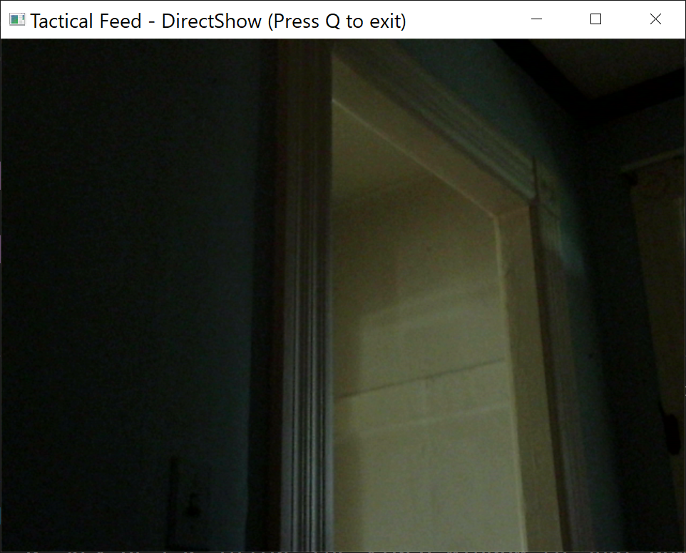
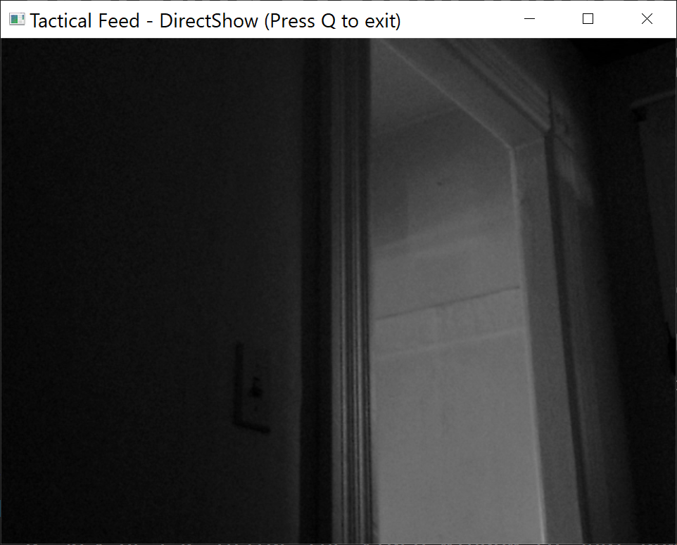
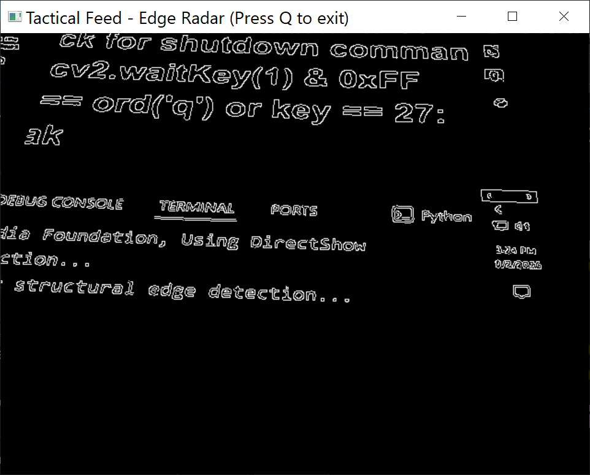
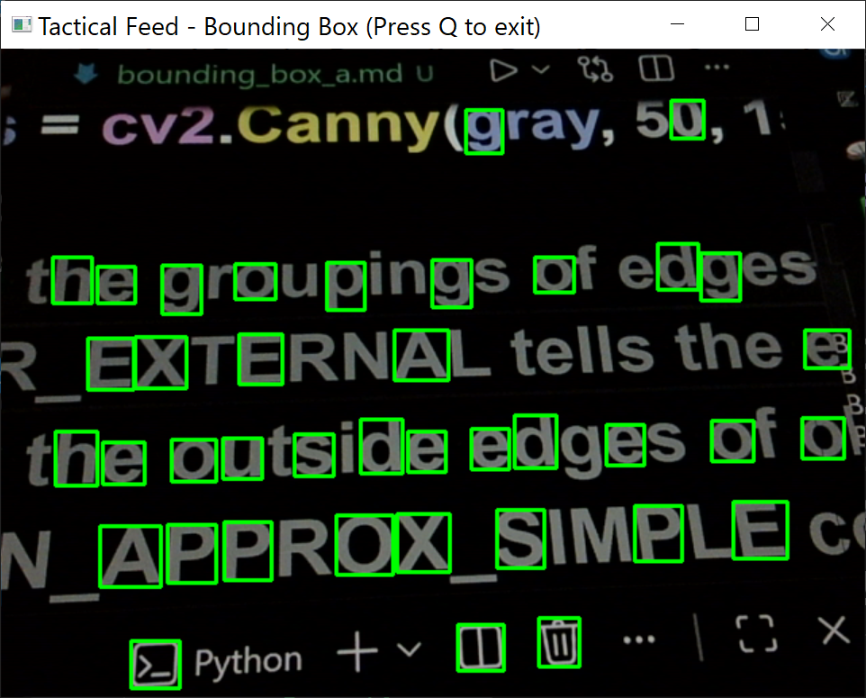
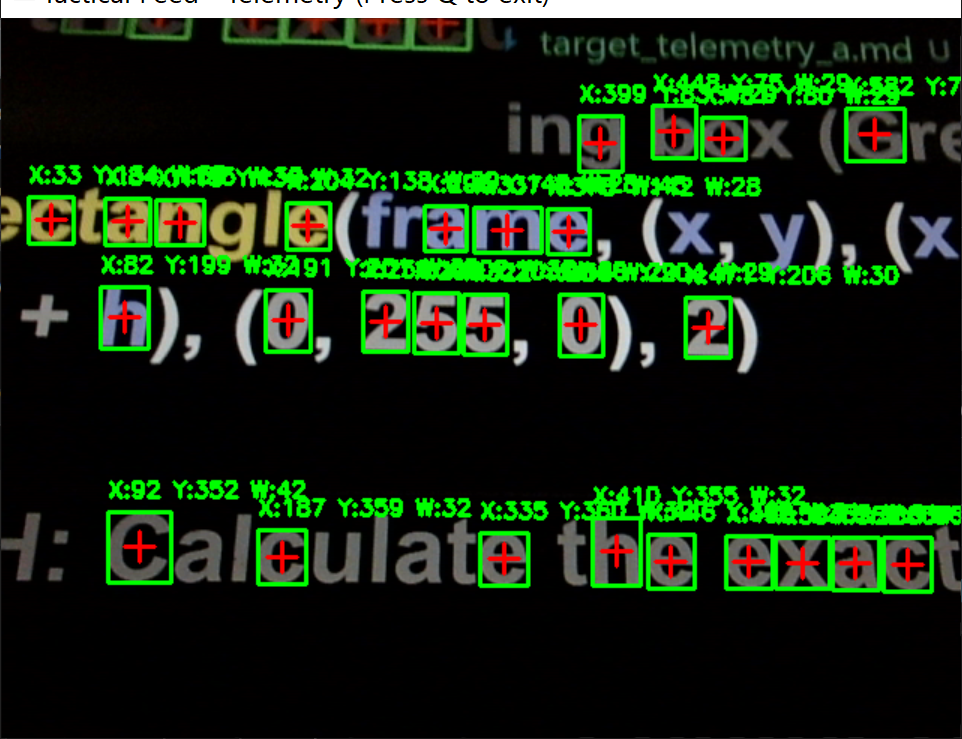
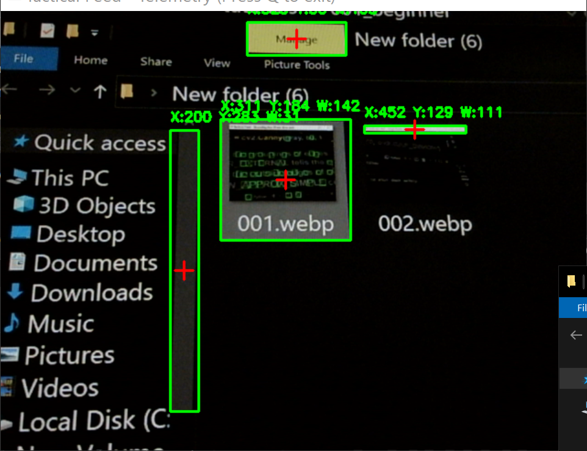
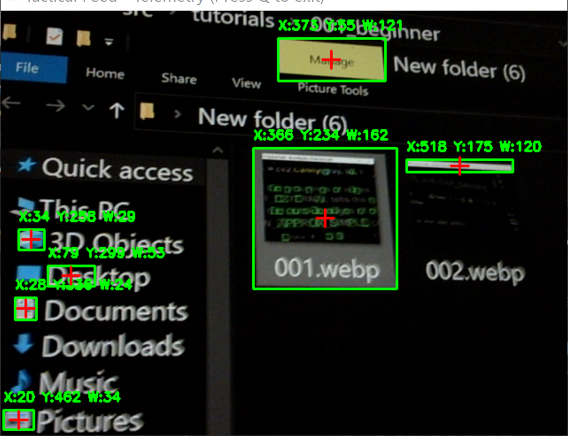

# CATopalian PY OpenCV Tutorials
The implementation of OpenCV on Python is excellent. Computer vision using Python is a lot of fun to learn and teach! 

---

Created in collaboration with my brother Albert Gemini

---

### Install OpenCV on for Python
Open **Command Prompt** and type  
### **pip install opencv-python**  
Press **Enter**

---

## [open_camera.py](src/tutorials/001_beginner/001_open_camera/open_camera.py)

## [open_camera_a.md](src/tutorials/001_beginner/001_open_camera/open_camera_a.md)

---

## [open_camera_grayscale.py](src/tutorials/001_beginner/002_open_camera_grayscale/open_camera_grayscale.py)

## [open_camera_grayscale_a.md](src/tutorials/001_beginner/002_open_camera_grayscale/open_camera_grayscale_a.md)

---

## [capture_screenshot.py](src/tutorials/001_beginner/003_capture_screenshot/capture_screenshot.py)

## [capture_screenshot_a.md](src/tutorials/001_beginner/003_capture_screenshot/capture_screenshot_a.md)

---

## [edge_detection.py](src/tutorials/001_beginner/004_edge_detection/edge_detection.py)  

## [edge_detection.md](src/tutorials/001_beginner/004_edge_detection/edge_detection_a.md)

---

## [bounding_box.py](src/tutorials/001_beginner/005_bounding_box/bounding_box.py)  

## [bounding_box.md](src/tutorials/001_beginner/005_bounding_box/bounding_box_a.md)  

  

---

## [target_telemetry.py](src/tutorials/001_beginner/006_target_telemetry/target_telemetry.py)  

## [target_telemetry_a.md](src/tutorials/001_beginner/006_target_telemetry/target_telemetry_a.md)  

  

  

  

---

### How to Download this App
1. Click the green Code Button on this github page
2. Choose Download ZIP
3. Save the Zip File
4. Extract All
5. Open the Python File in VSCode

---

Happy Scripting :-)

---

// Dedicated to God the Father  
// Copyright (c) 2026 Christopher Andrew Topalian  
// https://github.com/ChristopherTopalian  
// https://github.com/ChristopherAndrewTopalian  
// https://sites.google.com/view/CollegeOfScripting

